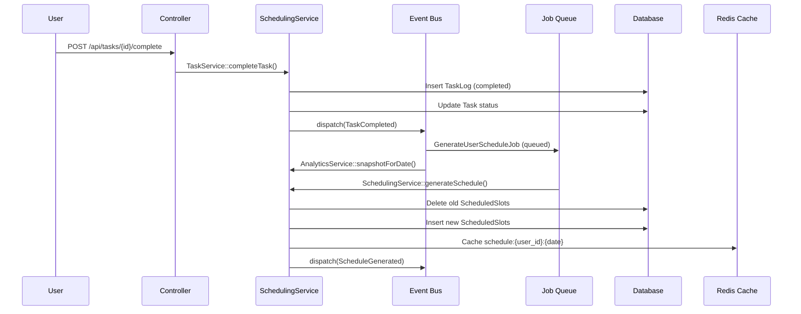

# GoalOS — Adaptive AI Goal & Routine Operating System

A production-ready deterministic + AI-assisted goal execution system. This is **not** a habit tracker, calendar, or todo list — it is a rolling-window scheduling engine driven by task metadata, capacity modeling, and adaptive analytics.

---

## User Review Required

> [!IMPORTANT]
> **AI Integration**: The spec calls for `POST /api/goals/{id}/ai-plan`, `ai-review`, and `POST /api/chat`. These require an LLM provider (OpenAI, Anthropic, etc.). Do you want to wire up a real LLM provider in the MVP, or stub these endpoints with placeholder responses initially?

> [!IMPORTANT]
> **Database**: The existing app uses SQLite for local dev. The spec calls for MySQL + Redis in production. For this MVP, we'll build with MySQL-compatible schema on SQLite locally and Redis on a queue driver (using database fallback if Redis isn't running). Is that acceptable, or do you want Redis + MySQL configured now?

> [!IMPORTANT]
> **Auth**: The app already has Fortify + Passkeys + 2FA. All GoalOS features will be user-scoped and auth-gated. The existing setup is kept as-is.

> [!WARNING]
> **Scope**: This is a very large system. The plan below covers the full MVP in phases. Phase 1 is the backend schema + services + API. Phase 2 is the Vue frontend. Do you want both phases in one pass, or phase-by-phase?

---

## Open Questions

> [!IMPORTANT]
> 1. Should `CapacityModel` be per-user (stored in `user_capacity_profiles`) and editable from the UI, or hardcoded defaults for MVP?
> 2. For the AI Coach Chat (`POST /api/chat`), should it be context-aware of the user's goals/tasks, or a generic assistant for now?
> 3. Do you want a dark-mode-first UI or system-preference-adaptive?

---

## Architecture Overview

```
GoalOS
├── Backend (Laravel 13, PHP 8.3+)
│   ├── Domain: Goals, Tasks, Routines, Scheduling, Analytics, AI
│   ├── Service Layer (single-purpose, DI-injected)
│   ├── Jobs (async scheduling computation)
│   ├── Events (state change propagation)
│   └── REST API (auth-gated, versioned via /api prefix)
└── Frontend (Vue 3 + Inertia v3 + TypeScript + Tailwind v4)
    ├── Dashboard (goal overview, today's plan)
    ├── Goal Workspace (goal → tasks → schedule)
    ├── Task Board (kanban-style with attributes)
    ├── Routine View (daily routine management)
    ├── Analytics (completion rates, energy patterns)
    └── AI Coach Chat (contextual coaching)
```

---

## Proposed Changes

### Phase 1: Database Schema

All tables are normalized — no JSON arrays for core logic. Enums are stored as MySQL ENUM / string columns with validation enforced at the app layer.

---

#### [NEW] Migration: `create_goals_table`
```
goals
├── id
├── user_id (FK users)
├── title
├── description (nullable)
├── status: enum(active, paused, completed, archived)
├── target_date (nullable date)
├── color (nullable, hex for UI)
├── order_index (integer, for drag-and-drop sorting)
├── timestamps
```

#### [NEW] Migration: `create_tasks_table`
```
tasks
├── id
├── goal_id (FK goals)
├── parent_task_id (nullable FK tasks — for subtasks)
├── title
├── estimated_minutes
├── actual_minutes (nullable — filled on completion)
├── order_index
├── status: enum(pending, in_progress, completed, skipped, archived)
├── due_date (nullable — soft hint only, NOT a calendar anchor)
├── timestamps
```

#### [NEW] Migration: `create_task_attributes_table`
```
task_attributes
├── id
├── task_id (FK tasks, unique — one-to-one)
├── priority: enum(low, medium, high, critical)
├── type: enum(learning, practice, execution, review, planning)
├── flexibility: enum(fixed, flexible, optional)
├── reschedule_policy: enum(strict, soft, skip_allowed)
├── energy_level: enum(low, medium, high)
├── grouping_key (nullable string, e.g. "interview_prep")
├── can_merge: boolean default false
├── can_split: boolean default false
├── timestamps
```

#### [NEW] Migration: `create_task_dependencies_table`
```
task_dependencies
├── id
├── task_id (FK tasks — the dependent task)
├── depends_on_task_id (FK tasks — must be completed first)
├── timestamps
```
*Unique constraint on (task_id, depends_on_task_id). No self-references enforced at DB.*

#### [NEW] Migration: `create_task_logs_table`
```
task_logs
├── id
├── task_id (FK tasks)
├── user_id (FK users)
├── date (date — the calendar day this log is for)
├── action: enum(scheduled, completed, skipped, missed, rescheduled, split, merged)
├── notes (nullable text)
├── duration_minutes (nullable — actual time spent)
├── timestamps
```

#### [NEW] Migration: `create_user_capacity_profiles_table`
```
user_capacity_profiles
├── id
├── user_id (FK users, unique)
├── daily_available_minutes (default 240 — 4h)
├── preferred_time_blocks: JSON array of time_block enums (nullable)
├── monday_minutes … sunday_minutes (nullable overrides per weekday)
├── timestamps
```
*Note: preferred_time_blocks is the ONE place JSON is acceptable — it's a flat list of string preferences, not a relational entity.*

#### [NEW] Migration: `create_scheduled_slots_table`
```
scheduled_slots (rolling window output — 1–7 days only)
├── id
├── user_id (FK users)
├── task_id (FK tasks, nullable — null for merged group)
├── grouping_key (nullable — for merged slots)
├── date (date)
├── time_block: enum(morning, afternoon, evening, anytime)
├── allocated_minutes
├── slot_index (ordering within day)
├── is_merged: boolean default false
├── merged_task_ids: JSON (nullable — task IDs merged into this slot)
├── status: enum(pending, completed, skipped)
├── timestamps
```
*Slots are regenerated on-demand. They are cache output, not source of truth.*

#### [NEW] Migration: `create_routines_table`
```
routines
├── id
├── goal_id (FK goals, nullable — routines can be standalone)
├── user_id (FK users)
├── title
├── frequency: enum(daily, weekdays, weekends, weekly, custom)
├── custom_days: JSON (nullable — array of weekday ints 0-6 for custom)
├── time_block: enum(morning, afternoon, evening, anytime)
├── is_active: boolean default true
├── timestamps
```

#### [NEW] Migration: `create_routine_steps_table`
```
routine_steps
├── id
├── routine_id (FK routines)
├── title
├── estimated_minutes
├── energy_level: enum(low, medium, high)
├── order_index
├── timestamps
```

#### [NEW] Migration: `create_routine_instances_table`
```
routine_instances
├── id
├── routine_id (FK routines)
├── user_id (FK users)
├── date (date)
├── status: enum(pending, completed, partial, skipped)
├── completed_steps: JSON (nullable — array of step IDs completed)
├── timestamps
```
*Unique constraint on (routine_id, date).*

#### [NEW] Migration: `create_analytics_snapshots_table`
```
analytics_snapshots (pre-computed daily by scheduler)
├── id
├── user_id (FK users)
├── date (date)
├── total_tasks_scheduled
├── total_tasks_completed
├── total_tasks_skipped
├── total_tasks_missed
├── completion_rate (decimal 5,2)
├── avg_task_duration_minutes (nullable decimal)
├── timestamps
```

---

### Phase 2: Models

#### [NEW] `app/Models/Goal.php`
- Relations: `belongsTo(User)`, `hasMany(Task)`, `hasMany(Routine)`
- Scopes: `active()`, `forUser(User $user)`
- PHPDoc property types for all columns

#### [NEW] `app/Models/Task.php`
- Relations: `belongsTo(Goal)`, `hasOne(TaskAttribute)`, `hasMany(TaskDependency, 'task_id')`, `hasMany(TaskDependency, 'depends_on_task_id')`, `hasMany(TaskLog)`, `hasMany(ScheduledSlot)`
- Scopes: `pending()`, `byPriority()`, `forGroupingKey(string $key)`

#### [NEW] `app/Models/TaskAttribute.php`
- Relations: `belongsTo(Task)`
- Casts for all enum columns

#### [NEW] `app/Models/TaskDependency.php`
- Relations: `belongsTo(Task, 'task_id')`, `belongsTo(Task, 'depends_on_task_id')`

#### [NEW] `app/Models/TaskLog.php`
- Relations: `belongsTo(Task)`, `belongsTo(User)`

#### [NEW] `app/Models/ScheduledSlot.php`
- Relations: `belongsTo(Task)`, `belongsTo(User)`

#### [NEW] `app/Models/UserCapacityProfile.php`
- Relations: `belongsTo(User)`
- Helper: `minutesForDate(Carbon $date): int`

#### [NEW] `app/Models/Routine.php`
- Relations: `belongsTo(User)`, `belongsTo(Goal)`, `hasMany(RoutineStep)`, `hasMany(RoutineInstance)`

#### [NEW] `app/Models/RoutineStep.php`
- Relations: `belongsTo(Routine)`

#### [NEW] `app/Models/RoutineInstance.php`
- Relations: `belongsTo(Routine)`, `belongsTo(User)`

#### [NEW] `app/Models/AnalyticsSnapshot.php`
- Relations: `belongsTo(User)`

---

### Phase 3: Services (Domain Layer)

All services are injected via constructor and live in `app/Services/`.

---

#### [NEW] `app/Services/GoalService.php`
```
- createGoal(User, array $data): Goal
- updateGoal(Goal, array $data): Goal
- archiveGoal(Goal): Goal
- getGoalsForUser(User): Collection<Goal>
```

#### [NEW] `app/Services/TaskService.php`
```
- createTask(Goal, array $data): Task
- updateTask(Task, array $data): Task
- completeTask(Task, User, int $durationMinutes): TaskLog
- skipTask(Task, User): TaskLog
- getTasksForGoal(Goal): Collection<Task>
```

#### [NEW] `app/Services/DependencyService.php`
```
- addDependency(Task $task, Task $dependsOn): TaskDependency
- removeDependency(Task $task, Task $dependsOn): bool
- getUnblockedTasks(Collection<Task> $tasks): Collection<Task>
  → Topological sort (Kahn's algorithm) to resolve ordering
- hasCyclicDependency(Task $task, Task $newDep): bool
```

#### [NEW] `app/Services/CapacityService.php`
```
- getProfileForUser(User): UserCapacityProfile
- updateProfile(User, array $data): UserCapacityProfile
- getAvailableMinutesForDate(User, Carbon $date): int
  → Checks weekday overrides, falls back to daily_available_minutes
```

#### [NEW] `app/Services/GroupingService.php`
```
- groupByKey(Collection<Task> $tasks): Collection (keyed by grouping_key)
- mergeTasks(Collection<Task> $tasks): MergedTaskDTO
  → Returns a DTO with combined estimated_minutes, merged task IDs
- canMerge(Task $a, Task $b): bool
  → true if same grouping_key AND both can_merge = true
```

#### [NEW] `app/Services/SchedulingService.php` ← **CORE ENGINE**

This is the deterministic scheduler. Pure PHP, no AI.

```
Algorithm (5-step pipeline):

Step 1 — loadPendingTasks(User, int $days = 7): Collection<Task>
  - Load pending tasks ordered by: priority DESC, due_date ASC, order_index ASC
  - Eager load: taskAttribute, dependencies

Step 2 — applyConstraints(Collection<Task>, User): Collection<Task>
  - Filter tasks where dependencies are satisfied (DependencyService::getUnblockedTasks)
  - Skip fixed tasks outside their preferred time_block
  - Respect flexibility: optional tasks are deprioritized

Step 3 — groupTasks(Collection<Task>): array<string, Collection<Task>>
  - Group by grouping_key
  - Merge tasks within a group if can_merge = true (GroupingService)

Step 4 — packSchedule(array<groups>, User, Carbon $startDate, int $days): array<ScheduledSlot>
  Knapsack heuristic per day:
    - Get capacity for the day (CapacityService)
    - Sort groups by priority + energy_level (high energy → morning preference)
    - Fill capacity greedily:
        - If task fits entirely → schedule it
        - If task is too large + can_split → split remainder to next day
        - If capacity exhausted → defer to next day
    - Record splits in task_logs

Step 5 — persistSlots(array<ScheduledSlot>, User): void
  - Delete existing pending slots for user in window
  - Bulk insert new slots
  - Cache result in Redis with key "schedule:{user_id}:{date}"

Public interface:
- generateSchedule(User, Carbon $startDate = null, int $days = 7): Collection<ScheduledSlot>
- getTodayPlan(User): Collection<ScheduledSlot>
- getWindowPlan(User, int $days = 7): Collection<ScheduledSlot>
- handleMissedTask(Task, User, Carbon $date): void
  → Marks as missed in task_log
  → Does NOT shift schedule
  → Triggers recompute for remaining window
```

#### [NEW] `app/Services/RoutineService.php`
```
- createRoutine(User, array $data): Routine
- generateInstancesForDate(User, Carbon $date): Collection<RoutineInstance>
  → Creates instances for all active routines matching the day's frequency
  → Idempotent: uses firstOrCreate on (routine_id, date)
- completeStep(RoutineInstance, int $stepId): RoutineInstance
- skipRoutine(RoutineInstance): RoutineInstance
- getTodayRoutines(User): Collection<RoutineInstance>
```

#### [NEW] `app/Services/MomentumService.php`
```
- detectPatterns(User): array<PatternDTO>
  Deterministic pattern detection:
  - completion_rate_by_weekday(User): array<int, float>
  - skipped_task_clusters(User): array (tasks frequently skipped together)
  - energy_mismatch_rate(User): float (high-energy tasks completed at low %)
  - avg_actual_vs_estimated(User): float

- generateAdaptations(User): array<AdaptationDTO>
  Rule engine output:
  - If Friday completion < 50%: suggest reducing Friday load
  - If tasks >60min skipped >50%: suggest enabling can_split
  - If high-energy tasks failing: suggest rescheduling to morning
  - If morning tasks skipped often: suggest shifting to afternoon
```

#### [NEW] `app/Services/AnalyticsService.php`
```
- snapshotForDate(User, Carbon $date): AnalyticsSnapshot
- getCompletionTrend(User, int $days = 30): Collection<AnalyticsSnapshot>
- getWeekdayHeatmap(User): array<string, float>
- getEnergyPerformance(User): array<string, float>
```

#### [NEW] `app/Services/AIPlannerService.php`
```
- generateRoadmap(Goal, User): array (AI-generated task breakdown)
  → Prompt includes: goal title, target_date, user patterns from AnalyticsService
  → Returns structured array of task suggestions
  → Dispatched as a queued job

- generateWeeklyReview(User): array
  → Prompt includes: last 7 days analytics, momentum patterns
  → Returns structured coaching feedback

- chatResponse(User, string $message, array $context): string
  → Context includes: user goals, today's plan, recent performance
  → Returns AI message string
```

---

### Phase 4: Events & Jobs

#### [NEW] Events (app/Events/)
- `GoalCreated(Goal)`
- `TaskCompleted(Task, User, TaskLog)`
- `TaskSkipped(Task, User, TaskLog)`
- `ScheduleGenerated(User, Collection<ScheduledSlot>)`
- `RoutineInstanceCreated(RoutineInstance)`

#### [NEW] Listeners (app/Listeners/)
- `OnTaskCompleted` → invalidates schedule cache, triggers MomentumService check
- `OnTaskSkipped` → logs to analytics, checks patterns
- `OnScheduleGenerated` → clears old cached slots

#### [NEW] Jobs (app/Jobs/)
- `GenerateUserScheduleJob(User $user, int $days = 7)` — dispatched by scheduler + API
- `GenerateRoutineInstancesJob(User $user, Carbon $date)` — daily cron
- `ComputeAnalyticsSnapshotJob(User $user, Carbon $date)` — daily cron
- `AIPlanGoalJob(Goal $goal, User $user)` — queued on AI endpoint call
- `AIReviewWeekJob(User $user)` — queued on AI review endpoint call

#### [MODIFY] `app/Console/Commands/` — cron entries
- Daily 00:01: `GenerateRoutineInstancesJob` for all users
- Daily 00:05: `GenerateUserScheduleJob` for all active users
- Daily 23:55: `ComputeAnalyticsSnapshotJob` for all users

---

### Phase 5: HTTP Layer

#### [NEW] `app/Http/Controllers/Api/GoalController.php`
- `index()` → GET /api/goals
- `store()` → POST /api/goals
- `show()` → GET /api/goals/{goal}
- `update()` → PUT /api/goals/{goal}
- `destroy()` → DELETE /api/goals/{goal}

#### [NEW] `app/Http/Controllers/Api/TaskController.php`
- `index()` → GET /api/goals/{goal}/tasks
- `store()` → POST /api/goals/{goal}/tasks
- `show()` → GET /api/tasks/{task}
- `update()` → PUT /api/tasks/{task}
- `complete()` → POST /api/tasks/{task}/complete
- `skip()` → POST /api/tasks/{task}/skip

#### [NEW] `app/Http/Controllers/Api/ScheduleController.php`
- `generate()` → POST /api/goals/{goal}/schedule/generate
- `show()` → GET /api/goals/{goal}/schedule
- `today()` → GET /api/schedule/today
- `window()` → GET /api/schedule/window

#### [NEW] `app/Http/Controllers/Api/RoutineController.php`
- `index()` → GET /api/routines
- `store()` → POST /api/routines
- `update()` → PUT /api/routines/{routine}
- `today()` → GET /api/routines/today
- `completeStep()` → POST /api/routine-instances/{instance}/steps/{step}/complete
- `skipInstance()` → POST /api/routine-instances/{instance}/skip

#### [NEW] `app/Http/Controllers/Api/AIPlannerController.php`
- `planGoal()` → POST /api/goals/{goal}/ai-plan
- `reviewWeek()` → POST /api/goals/{goal}/ai-review
- `chat()` → POST /api/chat

#### [NEW] `app/Http/Controllers/Api/AnalyticsController.php`
- `summary()` → GET /api/analytics/summary
- `heatmap()` → GET /api/analytics/heatmap
- `energyPerformance()` → GET /api/analytics/energy

#### [NEW] Form Requests (app/Http/Requests/)
- `StoreGoalRequest`, `UpdateGoalRequest`
- `StoreTaskRequest`, `UpdateTaskRequest`, `CompleteTaskRequest`
- `StoreRoutineRequest`

#### [NEW] API Resources (app/Http/Resources/)
- `GoalResource`, `GoalCollection`
- `TaskResource` (includes TaskAttribute)
- `ScheduledSlotResource`, `DailyPlanResource`
- `RoutineResource`, `RoutineInstanceResource`

#### [MODIFY] `routes/web.php` — Add Inertia page routes for all frontend views
#### [NEW] `routes/api.php` — All REST API routes, auth-gated with `auth:sanctum` or session

---

### Phase 6: Vue Frontend

Stack: Vue 3 + TypeScript + Inertia v3 + Tailwind v4. Dark-mode-first.

#### Pages (resources/js/pages/)

| Page | Path | Description |
|------|------|-------------|
| Dashboard | `Dashboard.vue` | Goal cards + Today's plan + Momentum alerts |
| Goal Workspace | `goals/Show.vue` | 3-column layout: goals list / task board / AI panel |
| Task Board | `tasks/Board.vue` | Kanban: pending / in_progress / completed |
| Routine View | `routines/Index.vue` | Today's routines + steps checklist |
| Analytics | `analytics/Index.vue` | Charts: completion heatmap, energy performance |
| AI Coach | `ai/Chat.vue` | Chat UI with goal context |

#### Layout

**`AppLayout.vue`** — persistent sidebar with goal navigation + top bar with "What should I do now?" CTA pulling today's schedule.

#### Key Components (resources/js/components/)

- `GoalCard.vue` — goal status, progress ring, quick actions
- `TaskItem.vue` — task row with priority badge, energy indicator, attributes
- `TaskAttributeForm.vue` — attribute editor (priority, type, flexibility, energy)
- `ScheduledSlot.vue` — daily plan slot with time block, merge indicator
- `RoutineStepItem.vue` — step with checkbox + time estimate
- `MomentumAlert.vue` — deterministic pattern-detected suggestion card
- `EnergyHeatmap.vue` — weekday × energy level grid
- `AIChat.vue` — chat message thread + input

#### Pinia Stores (resources/js/stores/)
- `useGoalStore` — CRUD + active goal selection
- `useScheduleStore` — today/window plan + polling every 30s
- `useRoutineStore` — today's instances + step completion
- `useAnalyticsStore` — snapshots, heatmap data
- `useAIStore` — chat history, review state

---

## Event-Driven Flow Diagram



---

## Scheduling Algorithm Detail

```
SchedulingService::packSchedule() pseudocode:

for day in [today .. today+6]:
    capacity = CapacityService::getAvailableMinutesForDate(user, day)
    used = 0
    slots = []

    sorted_groups = sortByPriority(pending_groups)
        # priority weight: critical=4, high=3, medium=2, low=1
        # energy tiebreak: high→morning, low→evening

    for group in sorted_groups:
        tasks = group.tasks
        total = sum(task.estimated_minutes for task in tasks)

        if group.can_merge and len(tasks) > 1:
            # Merge into single slot
            if used + total <= capacity:
                slots.append(MergedSlot(tasks, day))
                used += total
                mark_tasks_as_scheduled(tasks)
            elif used + total > capacity and any(task.can_split):
                # Split: fill remaining capacity, defer rest
                fill = capacity - used
                slots.append(MergedSlot(tasks, day, allocated=fill))
                used = capacity
                carry_remaining_to_next_day(tasks, fill)
            else:
                defer_group_to_next_day(group)
        else:
            for task in tasks:
                attr = task.taskAttribute
                if attr.flexibility == 'optional' and used > capacity * 0.8:
                    continue  # skip optional tasks when 80% capacity reached
                if used + task.estimated_minutes <= capacity:
                    slots.append(Slot(task, day))
                    used += task.estimated_minutes
                elif attr.can_split:
                    fill = capacity - used
                    if fill >= 15:  # min split size: 15 minutes
                        slots.append(Slot(task, day, allocated=fill))
                        used = capacity
                        create_split_remainder(task, fill)
                else:
                    defer_task_to_next_day(task)

    persist(slots)
```

---

## Verification Plan

### Automated Tests (Pest)
- `GoalServiceTest` — CRUD, user isolation
- `TaskServiceTest` — complete/skip, log creation
- `DependencyServiceTest` — topological sort, cycle detection
- `GroupingServiceTest` — can_merge logic
- `SchedulingServiceTest` — knapsack packing, split/defer, missed task handling
- `CapacityServiceTest` — weekday overrides
- `RoutineServiceTest` — instance generation, idempotency
- `MomentumServiceTest` — pattern detection rules
- API Feature Tests for all controller endpoints (auth-gated responses, resource shapes)

### Manual Verification
- Run `composer run dev` and verify all routes load without JS errors
- Create a goal, add tasks with attributes, generate schedule, verify rolling window output
- Mark a task as completed, verify schedule regenerates without calendar shift
- Verify routine instances are generated correctly for each frequency type

---

## MVP Build Roadmap

| Phase | Scope | Deliverable |
|-------|-------|-------------|
| 1 | Migrations + Models + Factories | DB schema live, all models with relations |
| 2 | Core Services (Goal, Task, Dependency, Capacity, Grouping) | Service layer tested |
| 3 | SchedulingService (deterministic engine) | Full scheduler with tests |
| 4 | RoutineService + MomentumService | Routine lifecycle + pattern detection |
| 5 | Events + Jobs + Cron | Async scheduling + daily generation |
| 6 | HTTP Layer (Controllers + Resources + Requests + Routes) | Full REST API |
| 7 | Vue Frontend — Layout + Dashboard + Goal Workspace | Core UI |
| 8 | Vue Frontend — Task Board + Routine View + Analytics | Secondary views |
| 9 | AI Coach Chat (stubbed or wired) | Chat UI + endpoint |
| 10 | Tests + Pint + PHPStan | CI-ready |