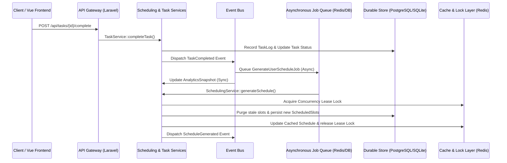

# AD. Routine (RoutineOS)

> Reliable, capacity-aware task scheduling and routine orchestration for distributed goal-execution networks, built around leased processing, idempotent step execution, and automated failure recovery.

* **At-Least-Once Delivery**: Guarantees that all task state transitions, scheduling cycles, and analytics logs are reliably captured, queued, and processed.
* **Lease-Based Concurrency Control**: Implements distributed user-level locks to serialize schedule generations, eliminating write-contention and execution storms.
* **Checkpoint-Based Recovery**: Supports task-splitting and incremental progress tracking, enabling work to resume from the last computed checkpoint.
* **Idempotent Routine Instantiation**: Ensures exactly one instance of a routine is generated per user per calendar day, regardless of concurrent worker retries or duplicate events.
* **Fault-Isolated Execution**: Leverages dedicated queues and Dead Letter Queues (DLQ) to isolate external AI service failures and poison tasks from critical planning paths.

---

## Why Reliability Matters

In real production systems, execution pipelines face inevitable operational failures. AD. Routine is engineered to handle these issues gracefully:

* **Worker Crashes mid-schedule generation**: When a worker fails mid-pack, database transactions discard the partially computed schedule, falling back to the cached Redis state until a retry completes.
* **Concurrent Event Storms**: Rapid client updates (e.g., ticking off tasks) could trigger concurrent scheduling loops. The system serializes these loops using distributed locks.
* **External API Timeouts & Rate Limits**: Roadmaps and weekly coaching reviews call external LLM APIs (OpenAI/Anthropic). When these calls fail, they are isolated to backoff queues to prevent blocking core scheduling paths.
* **Duplicate Queue Deliveries**: At-least-once message queues can deliver events multiple times. We prevent double logging and duplicate routine runs via state-machine validation and composite database unique constraints.

---

## Reliability Guarantees

| Failure | Mitigation Strategy | Outcome |
| :--- | :--- | :--- |
| **Worker Crash** | Atomic transactions & lease timeouts | Lock expires, partial computations roll back, and next worker safely regenerates schedule. |
| **Duplicate Delivery** | Database-level unique indexes & state guards | Redelivered task completions or routine generation events are safely ignored. |
| **Retry Storms** | Decoupled queues & exponential backoff | Network failures on third-party integrations (e.g., AI) back off with jitter to avoid starvation. |
| **Partial Execution** | Checkpoint-based task splitting (`can_split`) | System schedules the maximum available minutes, logs progress, and defers remainder automatically. |
| **Poison Messages** | Dead Letter Queue (DLQ) isolation | Payload errors or unrecoverable exceptions are routed to DLQ after 3 failures, alerting operators. |

---

## Architecture



* **API Gateway**: Entrypoint that validates payloads, manages authentication, and triggers core transactional updates.
* **Domain Service Layer**: Pure domain logic classes (Scheduling, Routing, Grouping) that handle deterministic capacity packing and state orchestration.
* **Queue Workers**: Decoupled runner network managing resource-heavy operations (schedule packing, AI analysis) asynchronously.
* **Durable Persistence (PostgreSQL/MySQL)**: Serves as the immutable source of truth, enforcing relational integrity for task dependencies and histories.
* **Distributed Cache & Locking (Redis)**: Serializes concurrent mutations via user-scoped locks and buffers API read paths with cached plans.
* **Event Bus**: Dispatches state transition alerts to decouple analytics processing and coach triggers from client request paths.

---

## Job Lifecycle

A task completion and schedule regeneration sequence progresses through the following steps:

1. **Ingest**: User completes a task, sending a request to the API controller.
2. **Commit**: The controller updates task status and writes a completion log to the database in a single transaction.
3. **Trigger**: An event listener catches the completed status change and dispatches `GenerateUserScheduleJob` to the queue.
4. **Lease Acquisition**: A queue worker picks up the job and attempts to acquire a distributed lock (`schedule:lease:{user_id}`).
5. **Execution**: The worker runs the deterministic scheduling service to calculate the rolling 7-day plan, respecting priorities, dependencies, and capacity constraints.
6. **Flush & Save**: The worker updates the persistent database with the new scheduled slots and clears any stale schedule cache.
7. **Release**: The worker releases the lease lock and sends an acknowledgement (ACK) to the queue driver.
8. **Fault Mitigation**: If execution fails, the job retries up to 3 times with exponential backoff. If it still fails, it is moved to the Dead Letter Queue.

---

## Reliability Components

### Retry Strategy
* **Problem**: Temporary infrastructure issues (e.g., database deadlocks, network hiccups, or AI service timeouts) cause scheduling or roadmap tasks to fail midway.
* **Solution**: Asynchronous jobs (`GenerateUserScheduleJob`, `AIPlanGoalJob`) are configured with automatic retries and backoffs. Jobs are placed in separate worker queues to ensure that transient failures do not cause permanent data loss.
* **Tradeoff**: Auto-retries can increase worker queue depth and latency during prolonged database outages.

### Idempotency
* **Problem**: Message queues using at-least-once delivery can trigger duplicate events, risking duplicate task logs, double-allocated duration metrics, or multiple routine instances for the same calendar day.
* **Solution**: Database-level unique constraints (e.g., unique composite key on `(routine_id, date)`) and strict state transition validations guarantee that duplicate events are ignored.
* **Tradeoff**: Checking for pre-existing state adds a minor query overhead to event execution paths.

### Worker Leasing (Concurrency Control)
* **Problem**: Multiple concurrent client actions can trigger overlapping schedule packing loops, leading to database lock contention, write conflicts, and corrupted cache states.
* **Solution**: The scheduling engine must acquire an atomic distributed lease lock in Redis for the specific user before computing. Concurrent schedule requests are queued or ignored if a generation is already running.
* **Tradeoff**: Serializing execution introduces small delays for concurrent actions executed in rapid succession.

### Dead Letter Queue (DLQ)
* **Problem**: Poison payloads (e.g., corrupt job data) or unrecoverable third-party failures (e.g., expired API keys) will crash workers repeatedly, consuming CPU and blocking healthy jobs.
* **Solution**: Failed jobs that exhaust their retry budget (3 attempts) are automatically routed to the failed jobs table (DLQ), preserving system stability and enabling offline diagnostic debugging.
* **Tradeoff**: Poison messages remain in the DLQ until manual operator action is taken.

### Partial Recovery (Checkpointing)
* **Problem**: A task requiring 120 minutes of work cannot be scheduled if the user only has 45 minutes of daily capacity, leading to starvation or scheduling failures.
* **Solution**: Tasks with `can_split = true` are scheduled up to the available capacity. The system saves the scheduled segment, registers a partial completion log, and schedules the remaining time on the following day.
* **Tradeoff**: Splitting tasks increases database log volume and adds dependency complexity.

### Rate Limiting
* **Problem**: Downstream LLM APIs heavily rate-limit prompt requests, causing resource starvation in the main application loop if client AI requests spike.
* **Solution**: AI integration jobs are segregated to a dedicated, throttled queue connection with low concurrency settings, ensuring core scheduling queues remain unimpeded.
* **Tradeoff**: AI-driven roadmaps and coaching responses are processed slower during peak demand.

### Failure Injection
* **Problem**: Testing resilience mechanisms is difficult in a stable local dev environment without simulating real-world failures.
* **Solution**: The Pest test suite simulates database timeouts, concurrent locking failures, and API rate-limiting to verify that routing, retries, and transactional rollbacks work deterministically.
* **Tradeoff**: Maintaining mock injections increases testing codebase complexity.

---

## Engineering Decisions

| Decision | Rationale |
| :--- | :--- |
| **PostgreSQL / MySQL** | Chosen over NoSQL for transactional safety (ACID), foreign keys (for strict dependency trees), and fast index-based lookups during scheduling calculations. |
| **Redis Cache & Lock** | Utilized for fast distributed lock acquisition (leasing) and caching of the computed schedule, bypassing expensive SQL regeneration on read paths. |
| **Laravel Queue Architecture** | Provides built-in support for multiple queues, retry policies, backoffs, and dead letter queues, avoiding custom daemon orchestration. |
| **At-Least-Once Delivery** | Designed around at-least-once delivery semantics as availability and reliability are preferred over the heavy coordination overhead of exactly-once delivery. |
| **Application Idempotency** | Enforced at the application and DB schema levels to ensure duplicate events are safely discarded, preventing side effects (e.g., duplicate routine completions). |
| **Deterministic Knapsack Packing** | The scheduling engine uses a deterministic greedy knapsack heuristic rather than AI. This guarantees predictable, reproducible planning results that users can trust. |

---

## Failure Philosophy

1. **Failure is expected**: Workers, caches, networks, and databases will fail. The software must continue running.
2. **Recovery > Prevention**: Systems cannot prevent all crashes. High-signal architectures focus on automated recovery, transaction rollbacks, and queue retries.
3. **Duplicate execution is inevitable**: Due to network partitions, operations must be safe to execute multiple times.
4. **Determinism is paramount**: reschedules and recalculations with the same inputs must yield identical plans.
5. **State survives worker crashes**: In-progress changes are guarded by database transactions; crashes never result in partial writes or corrupt states.
6. **Automated Healing**: Rescheduling missed tasks and generating routine instances are handled by asynchronous event handlers without manual intervention.

---

## Technology Stack

* **Backend Framework**: Laravel 13 (PHP 8.3+) — Service-driven architecture, dependency injection.
* **Messaging & Queues**: Redis / database queue driver — Job dispatching, throttling, and isolation.
* **Persistence**: PostgreSQL / MySQL — ACID compliance, strict relational constraints, and index optimizations.
* **Coordination & Cache**: Redis — Distributed locks (leases) and cached schedule data.
* **Frontend SPA**: Vue 3 / Inertia.js v3 / Tailwind CSS v4 — Inertia client-side patterns, reactive dashboard.
* **Testing & Verification**: Pest 4 / PHPUnit — High-coverage suite simulating boundary cases and concurrent failures.

---

## Local Development

### Prerequisites
* PHP 8.3+ & Composer
* Node.js & npm
* SQLite/MySQL & Redis

### Quick Setup

1. **Install dependencies and migrate**:
   ```bash
   composer run setup
   ```
   *This command runs composer install, configures `.env`, generates the application key, runs database migrations, installs npm dependencies, and compiles assets.*

2. **Start the development servers**:
   ```bash
   composer run dev
   ```
   *This starts the PHP built-in server, Vite dev server, Pail logger, and the asynchronous queue listener concurrently.*

3. **Verify the installation**:
   Run the test suite to ensure all reliability mechanisms and core services function correctly:
   ```bash
   php artisan test --compact
   ```

---

## API Reference

| Endpoint | Method | Description | Reliability Feature |
| :--- | :--- | :--- | :--- |
| `/api/goals` | `GET` / `POST` | Retrieve or create high-level goals. | Transaction safety |
| `/api/goals/{goal}/tasks` | `GET` / `POST` | Retrieve or add tasks to a goal. | Dependency verification (cycle check) |
| `/api/tasks/{task}` | `GET` / `PUT` | View or update task details. | Attribute validation |
| `/api/tasks/{task}/complete` | `POST` | Mark task completed and log duration. | Idempotency guard, async schedule trigger |
| `/api/tasks/{task}/skip` | `POST` | Skip a task, writing skip logs. | Audit logging, schedule regeneration |
| `/api/schedule/today` | `GET` | Retrieve the active schedule slots for today. | Redis caching |
| `/api/schedule/window` | `GET` | Get rolling 7-day schedule plan. | Cache fallback, automated regeneration |
| `/api/routines` | `GET` / `POST` | Manage routine definitions. | Frequency validation |
| `/api/routines/today` | `GET` | Get generated routine instances. | Idempotent generation (`firstOrCreate`) |
| `/api/routine-instances/{instance}/skip`| `POST` | Skip a routine instance. | Logging & audit trail |
| `/api/analytics/summary` | `GET` | Retrieve performance summary data. | Pre-computed snapshots |
| `/api/goals/{goal}/ai-plan` | `POST` | Queue AI roadmap generation. | Async queue processing, DLQ fallback |
| `/api/goals/{goal}/ai-review` | `POST` | Queue AI performance review generation. | Throttled queue, automatic retry |
| `/api/chat` | `POST` | Interactive chat with the coaching model. | Isolated provider timeouts |

---

## Future Improvements

* **Distributed Tracing**: Integration of OpenTelemetry and Jaeger to trace lifecycles across HTTP, queues, and database boundaries.
* **Metrics Instrumentation**: Exporting queue latency, lock acquisition times, and database transaction metrics to Prometheus / Grafana.
* **Priority Queuing**: Allocating dedicated queue connections to separate high-priority user-interactive schedules from background analytics recalculations.
* **Kubernetes Deployment**: Orchestrating stateless web/worker pods utilizing Helm charts and autoscaling based on queue depth metrics.
* **Multi-Region Replication**: Supporting cross-region data replication and geo-distributed scheduling tasks.

---

## What This Demonstrates

This project demonstrates software engineering capabilities essential for high-availability distributed systems:

* **Distributed Systems Architecture**: Decoupling web layers from asynchronous computation workers using queues and event buses.
* **Concurrency & Locking Control**: Utilizing distributed mutexes and database isolation levels to manage race conditions.
* **Resilience Engineering**: Designing idempotent handlers, implementing automated retries, and configuring failure isolation via DLQs.
* **Database & Domain Design**: Architecting normalized database schemas, building strict dependency graphs, and implementing service layers using dependency injection.
* **Performance Optimization**: Balancing cache latency against read paths, implementing bulk inserts, and managing index structures.
* **Operational Thinking**: Acknowledging tradeoffs, monitoring considerations, testing failure cases, and designing for recoverability.
